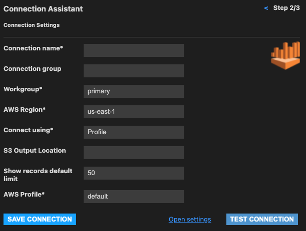

# SQLTools driver for AWS Athena

## Description

A Visual Studio Code extension which extends the [SQLTools extension](https://marketplace.visualstudio.com/items?itemName=mtxr.sqltools), with a driver to work with AWS Athena. It supports tables and views, as well as running queries.

## Configuration

When creating a new connection with AWS Athena, you'll be prompted to fill some authentication info.

### Access Key Id & Secret Access Key

You can create an authentication using [AWS IAM](https://aws.amazon.com/iam/). Be sure that the IAM user has the right [privileges](https://aws.amazon.com/premiumsupport/knowledge-center/access-denied-athena/) to query AWS Athena.

### Workgroup

It's the workgroup which will run the queries. Refer to [athena workgroup documentation](https://docs.aws.amazon.com/athena/latest/ug/user-created-workgroups.html).
Usually the `primary` workgroup is the one to go.

### AWS Region

The AWS Region code where your queries should be run.
Refer to the [AWS Region Code Table](https://docs.aws.amazon.com/AWSEC2/latest/UserGuide/using-regions-availability-zones.html#concepts-available-regions).

## Usage

After installing the SQLTools driver for __AWS Athena__, you will be able to create connections to AWS Athena, explore tables and views, and run queries.
For more information on how to use SQLTools please refer to [SQLTools extension](https://marketplace.visualstudio.com/items?itemName=mtxr.sqltools).

## Support

Please open [issues](https://github.com/kovihq/sqltools-athena-driver/issues) on github.
